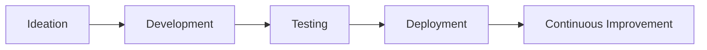

# 🚀 Welcome to Qaya Creatives 

<h2 align="center">Building the Future of SaaS Solutions</h2>

  

## 🌟 About Us

**Qaya Creatives** is an innovative tech startup focused on developing cutting-edge SaaS products that solve real business challenges. We combine beautiful design with powerful functionality to create tools that teams love to use.

🛠 Our SaaS Products

Product	Description	Status
https://img.shields.io/badge/QayaFlow-Workflow_Automation-%2523007ACC.svg?style=flat-square	AI-powered workflow automation	https://img.shields.io/badge/-Live-brightgreen
https://img.shields.io/badge/QayaMetrics-Business_Analytics-%2523FF6D00.svg?style=flat-square	Real-time business analytics dashboard	https://img.shields.io/badge/-Beta-yellow
https://img.shields.io/badge/QayaConnect-Team_Collaboration-%25236E40C9.svg?style=flat-square	All-in-one team collaboration suite	https://img.shields.io/badge/-Coming_Soon-blue

🚀 Why Choose Qaya Creatives?
🔥 Cutting-edge Technology: We use the latest tech stack to build scalable solutions

🎨 Beautiful UI/UX: Our products are designed for maximum usability

🔄 Continuous Updates: Regular feature releases and improvements

🔒 Enterprise-grade Security: Your data is always protected

🌍 Cloud-native: Access your tools from anywhere

💻 Tech Stack

https://img.shields.io/badge/React-20232A?style=for-the-badge&logo=react&logoColor=61DAFB
https://img.shields.io/badge/Node.js-339933?style=for-the-badge&logo=nodedotjs&logoColor=white
https://img.shields.io/badge/AWS-%2523FF9900.svg?style=for-the-badge&logo=amazon-aws&logoColor=white
https://img.shields.io/badge/MongoDB-%25234ea94b.svg?style=for-the-badge&logo=mongodb&logoColor=white
https://img.shields.io/badge/Docker-%25232496ED.svg?style=for-the-badge&logo=docker&logoColor=white

📈 Our Development Process
Discovery Phase: Understanding client needs

Prototyping: Rapid concept development

Agile Development: Two-week sprints

QA Testing: Rigorous quality assurance

Deployment: Smooth rollout

Maintenance: Ongoing support and updates

🤝 Get Involved

https://img.shields.io/badge/Slack_Qaya_Community-4A154B?style=for-the-badge&logo=slack&logoColor=white
https://img.shields.io/badge/Partner_With_Us-%252302569B.svg?style=for-the-badge&logo=google-chrome&logoColor=white
https://img.shields.io/badge/We're_Hiring!-%2523007ACC.svg?style=for-the-badge&logo=microsoft-academic&logoColor=white

📬 Contact Us
Have questions or want to discuss a project?

https://img.shields.io/badge/Email-info%2540qayacreatives.com-%2523D14836.svg?style=for-the-badge&logo=gmail&logoColor=white
https://img.shields.io/badge/Schedule_Call-%25238A2BE2.svg?style=for-the-badge
https://img.shields.io/badge/Twitter-%25231DA1F2.svg?style=for-the-badge&logo=Twitter&logoColor=white

📄 License
All our core products are MIT Licensed.
