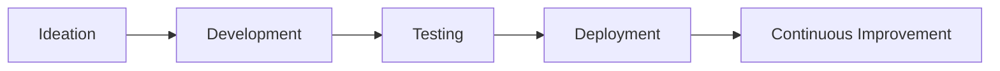

# 🚀 Welcome to Qaya Creatives 

<h2 align="center">Building the Future of SaaS Solutions</h2>

  

## 🌟 About Us

**Qaya Creatives** is an innovative tech startup focused on developing cutting-edge SaaS products that solve real business challenges. We combine beautiful design with powerful functionality to create tools that teams love to use.

## 🛠 Our SaaS Products

Product	Description	Status

## 🚀 Why Choose Qaya Creatives?
🔥 Cutting-edge Technology: We use the latest tech stack to build scalable solutions

🎨 Beautiful UI/UX: Our products are designed for maximum usability

🔄 Continuous Updates: Regular feature releases and improvements

🔒 Enterprise-grade Security: Your data is always protected

🌍 Cloud-native: Access your tools from anywhere

## 💻 Tech Stack

## 📈 Our Development Process
- Discovery Phase: Understanding client needs

- Prototyping: Rapid concept development

- Agile Development: Two-week sprints

- QA Testing: Rigorous quality assurance

- Deployment: Smooth rollout

- Maintenance: Ongoing support and updates

## 📬 Contact Us
Have questions or want to discuss a project?

  
  <a href='https:://annastacia.dev>' style="text-decoration: none;">
    
  </a>

## 📄 License
All our core products are MIT Licensed.
